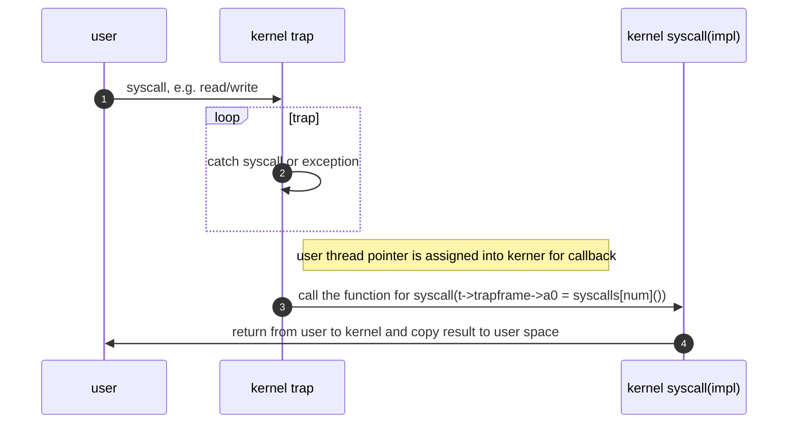
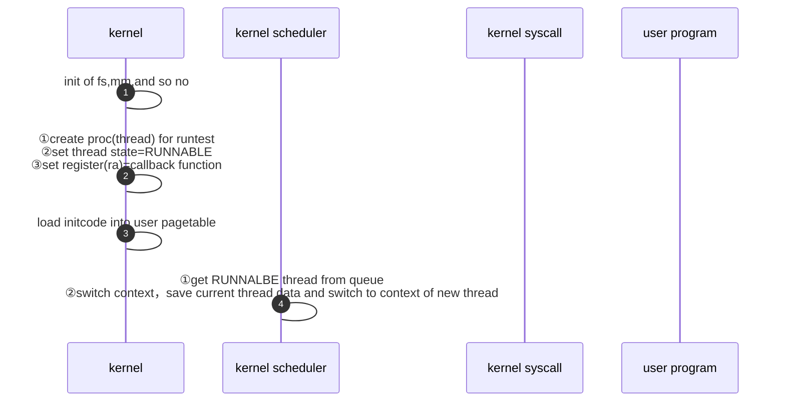
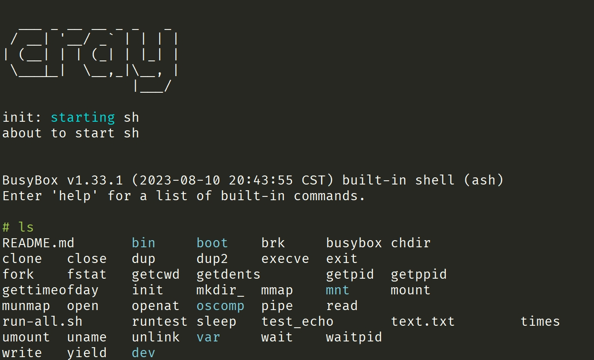

# CRAY

## 项目简介

本项目基于LostWakeupOS，针对部分程序和脚本进行调整，调整的内容主要包含以下2个方面
1. makefile的重构
2. 编写runtest程序，并通过脚本完成自动集成到工程中

### 工程目录结构

```shell
├── bootloader          # opensbi-qemu
├── build               # 项目构建过程中的中间临时文件
├── busybox             # busybox可以作为第一个用户程序，启动busybox sh
├── doc                 # 相关文档
├── fsimg               # fsimg是进行本地测试用的，sdcard.img挂载到fsimg，将相应的测试程序copy至该目录下
│   ├── bin             # 放置user目录下编译好的用户程序，比如说 ls cat echo
│   ├── boot            # 如果进行本地测试，makefile中runtest=0，boot/init可以作为第一个用户程序
│   ├── mnt             # 测试程序使用
│   └── var             # 测试程序使用
│       └── tmp
├── include             # 内核头文件，包含scripts/runtest.sh运行后，自动生成的initcode.h文件，子目录信息可以参加src目录说明
│   └── syscall_gen     # 通过scripts/syscalltbl.sh脚本自动生成的头文件
├── oscomp_user         # 该目录包含测试用例的源码，通过生成测试用例，并放置到sdcard.img中，进行本次的调试和测试
│   ├── build           # build的中间结果
│   ├── include         # 包含lib对应的头文件
│   ├── lib             # 包含stdio等基础函数的实现
│   └── src             # 包含测试用例的源程序
│       └── oscomp
├── scripts             # 包含makefile的共通处理，包含runtest和syscall的生成shell脚本
├── src                 # 内核目录
│   ├── atomic          # 原子操作
│   ├── driver          # 设备，包含console的处理
│   ├── fs              # 文件系统
│   ├── ipc             # 进程通信，包含管道、信号、socket、共享内存
│   ├── kernel          # 内核代码
│   │   └── asm
│   ├── lib             # 包含基础库函数
│   ├── mm              # 内存管理
│   ├── platform        # 平台相关
│   │   ├── hifive
│   │   │   └── driver
│   │   └── qemu
│   └── proc            # 内核和进程管理相关的逻辑
└── user                # 用户程序，编译后放置在sdcarmd.img镜像的bin目录中，包含echo、cat等
    ├── build           # build的中间结果
    │   ├── lib
    │   └── src
    ├── include
    ├── lib
    └── src             # 用户程序的源程序
```

### 构建工程

工程的默认目标是`all`，这个默认的目标是为了提交评测系统进行评测。

```C
all: qemu-kernel
```

通过执行`make all`或者`make`都可以实现提交评测，这个过程主要是完成内核kernel-qemu文件的生成，如果涉及到内核源码的修改，都需要重新执行`make all`或者`make kernel`，重新生成kernel-qemu。


如果需要在本地进行模拟测试，可以执行`local`目标，这个目标完成两件事情，重新制作sdcard.img文件，并将相关的测试程序放置到sdcard.img中。另外是重新生成内核文件。

```C
local:
	@make clean-all
	@make image
	@make kernel
```

通过执行`make local`可以方便实现两个阶段的工作，并通过`qemu-system-riscv64`命令启动虚拟机。另外，目标`kernel`和目标`qemu-kernel`相同，目标`image`专门负责生成sdcard.img文件。

`make clean`可以清理内核相关的中间产物，`make clean-all`可以清理sdcarmd.img和内核两部分的相关中间产物。


### 评测

操作系统经过一系列相关初始化之后，会调用用户程序，比如说sh，评测的要求是操作系统启动后，自动调用评测机上的测试程序，完成后关机，整体流程如下。
1. 通过`make`命令生成kernel-qemu内核文件
2. 评测机会调用如下命令自动启动qemu模拟器

```shell
qemu-system-riscv64 -machine virt -kernel kernel-qemu -m 128M -nographic -smp 2 -bios default -drive file=sdcard.img,if=none,format=raw,id=x0 -device virtio-blk-device,drive=x0,bus=virtio-mmio-bus.0 -no-reboot -device virtio-net-device,netdev=net -netdev user,id=net
```

3. kernel-qemu的内核需要自动扫描评测机的sdcard.img所对应的镜像文件，镜像文件根目录下存放32个测试程序
4. 根据自己内核的实现情况，在内核进入用户态后主动调用这些测试程序
5. 调用完测试程序后，主动关机退出

针对以上评测的流程，我主要完成了以下工作。
1. 编写调用测试用例的`runtest`，该测试程序的主要内容是循环调用`fork`，并在新建立的进程中，通过`execve`系统调用，调用评测机上的测试用例程序，如`brk`。
```C
    char* tests[] = {"brk", ....};
    for (int i = 0; i < testCounts; i++) {
        // 代码片段
        pid = fork();
        if (pid < 0) {
            printf("init: fork failed\n");
            exit(1);
        }
        if (pid == 0) {
            execve(tests[i], 0, envp);
            exit(1);
        }
    }
```
2. 编译`runtest`后，通过`scripts/runtest.sh`脚本将runtest生成16进制格式的文本
```shell
riscv64-linux-gnu-objcopy -S -O binary fsimg/runtest oo
od -v -t x1 -An oo | sed -E 's/ (.{2})/0x\1,/g' > include/initcode.h
```
其中，`riscv64-linux-gnu-objcopy -O binary`将文件以二进制方式输出，`-S`为去除符号表；od命令-v为不用`*`表示重复数据，`-t x1`表示输出为16机制，`-An`结果不包含地址信息；sed命令，将每一个16进制的码值前面添加`0x`标志，并且码值和码值中间通过逗号分隔。以上动作通过管道的方式最终将结果输出到`include/initcode.h`中，摘取`initcode.h`的片段如下：
```c
0x5d,0x71,0xa2,0xe0,0x86,0xe4,0x26,0xfc,0x4a,0xf8,0x4e,0xf4,0x52,0xf0,0x56,0xec,
0x5a,0xe8,0x5e,0xe4,0x62,0xe0,0x80,0x08,0x93,0x05,0x60,0x1b,0x17,0x15,0x00,0x00,
0x13,0x05,0x45,0xdf,0x97,0x10,0x00,0x00,0xe7,0x80,0xe0,0xbb,0x09,0x46,0x97,0x15,
```

3. 加载`runtest`到用户空间的页表中




## 如何调试

安装依赖库

```shell
apt-get install libncurses5
apt-get install libpython2.7
```

在启动gdb模式前，要执行`make image`保证sdcard.img文件生成，之后运行`make gdb`命令启动gdb模式，这个时候gdb模式下的`-S`参数会主动停止CPU运行，进入到挂起的状态，等待gdb进行连接，这个时候我们需要在新的终端窗口，运行如下命令进行连接。

```shell
# 调试kernel-qemu(elf)文件
riscv64-unknown-elf-gdb kernel-qemu
# 因为内核是在25000进行tcp的监听，所以我们连接该端口
(gdb) target remote :25000
Remote debugging using :25000
# 如果我们想从入口的main函数调试，可以通过下断点的方式进行逐步调试
(gdb) break main
# 继续执行下一语句
(gdb) continue
```

其中`25000`是启动qemu的时候gdb的参数，根据第一个启动内核窗口的日志决定`25000`具体是多少。通过以上步骤，就可以进行内核代码的调试工作。

## 内核运行效果

