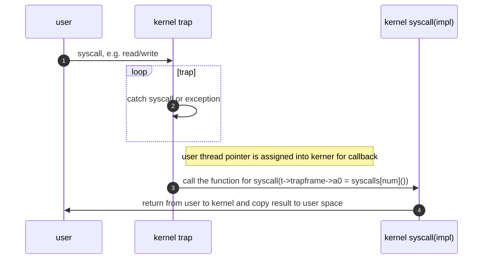

# 系统调用练习

## 如何查看系统调用

系统调用的过程分为几个阶段：

- 从用户态发起系统调用，并传递相关参数
- 内核对应的接口接收到系统调用的信号，根据系统调用号进行对应的处理
- 处理完毕后，将结果从内核态返回给用户态
- 用户根据返回结果执行业务逻辑

从内核的代码角度看，大致是如下流程

## 练习

### execve（优先级：高）

目前的代码实现使用了busybox执行shell，希望通过user/sh.c文件编译的sh替换掉busybox。
通过练习达成的目的：
1. 了解busybox的作用
2. 学会通过makefile，了解编译user目录下的程序（编译user/src/sh.c）
3. 修改execve这个系统调用，用sh替换掉busybox，通过编程实践环节熟悉整个流程、环境和一些细节

### 调用链路学习（优先级：中）

目的：通过以上信息，找到内核进行系统调用中断，调用的关键代码，并理解大概脉络

### mount（优先级：低）

目前内核并没有真正实现mount系统调用，可以通过学习研究xv6系统的代码，结合本工程，实现mount系统调用
目的：对内核的文件系统有深入的理解和掌握
